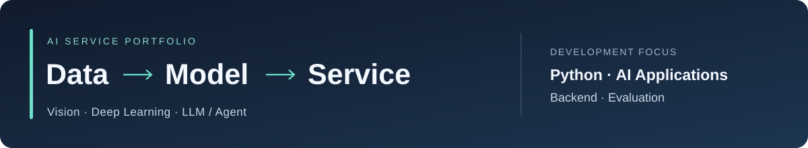

# 김수진 | Python 기반 AI 서비스 개발

**Vision·딥러닝·LLM/Agent를 실제 서비스로 연결하는 개발을 지향합니다.**

데이터 처리와 모델 평가부터 API·데이터베이스·사용자 화면까지 이어지는 프로젝트를 진행합니다.
각 프로젝트에서 해결하려는 문제와 기술 선택의 이유, 검증 과정을 함께 기록합니다.

[프로젝트 상세 소개](docs/PORTFOLIO.md) · [개발 진행 현황](docs/STATUS.md) · [공통 학습 기록](https://github.com/lightleaping/ai-developer-relearning-labs)

---

## Projects

**현재 단계: 설계·재구현 준비.** 아래 기능은 구현 목표이며, 실행 결과와 성능은 검증 후 추가합니다.

| 분야 | 프로젝트 | 목표 |
|---|---|---|
| **AI 서비스** | [Structured Bloom](https://github.com/lightleaping/structured-bloom-streamlit) | 기분·시간에 맞는 활동 추천과 이력 관리 |
| **딥러닝 · 분석 Agent** | [사례 기반 이상탐지](https://github.com/lightleaping/case-based-anomaly-agent) | 오류 검출부터 원인 후보 분석·설명·보고서 생성 |
| **Vision 응용** | [코디 추천·보드](https://github.com/lightleaping/fashion-outfit-board) | 실제 상품 이미지로 의류 조합 추천·코디 보드 출력 |
| **LLM · RAG · Agent** | [세계관 캐릭터 엔진](https://github.com/lightleaping/world-character-engine) | 기억과 상태에 맞는 응답·행동의 검증과 실행 |

## Development Approach

프로젝트마다 다음 세 가지를 확인하는 것을 목표로 합니다.

- **문제에 맞는 AI 적용:** 데이터와 요구사항에 맞춰 모델·검색·Agent의 역할을 정합니다.
- **서비스까지 연결:** 입력, 추론, API, 저장, 사용자 화면을 하나의 흐름으로 설계합니다.
- **근거가 있는 결과:** 비교 조건, 실패 사례, 직접 구현한 범위를 기록합니다.

## Contact

[GitHub · lightleaping](https://github.com/lightleaping) · [workingskyroad@gmail.com](mailto:workingskyroad@gmail.com)

학습·검증 및 포트폴리오 운영 문서

기존 프로젝트는 재학습·직접 구현·설명 확인을 거친 범위만 현재 역량으로 반영합니다.
과거 코드나 성능 수치를 새 프로젝트의 결과로 사용하지 않습니다.

[학습 역량표](docs/SKILLS.md) · [운영 자료](docs/README.md) · [검증 기준](docs/INTERVIEW-GATE.md)

2026-09-10 업데이트 · 프로젝트의 계획과 검증된 결과를 구분해 공개합니다.
