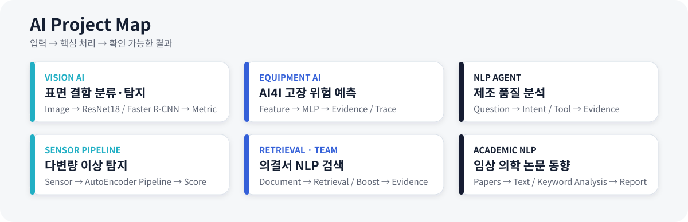

 

---

## Project Map

---

## Job Fit Summary

| 공고 핵심 | 프로젝트에서 보여주는 근거 |
|---|---|
| **Vision** | ResNet18 이미지 분류 · Faster R-CNN 객체 탐지 · OpenCV · 오분류 및 Detection 실패 분석 |
| **Time Series / Data** | RNN·LSTM 기본 구조 학습 · 센서 이상 탐지 파이프라인 · 설비 상태 Feature 기반 고장 위험 예측 |
| **NLP** | 제조 질문 Intent·Router·Tool·Evidence · BM25/Dense Retrieval · 논문 텍스트·키워드 분석 |
| **AI Service Solution** | PyTorch Model → FastAPI → Streamlit·SQLite · 입력 검증 · API·통합 테스트 |

> **주요 개발 언어와 프레임워크:** Python · PyTorch · FastAPI  
> **검증 방식:** 프로젝트 성격에 따라 모델 지표, 검색 결과 규칙, API 응답, 실패 사례와 한계를 구분해 확인합니다.

---

# Featured Projects

## 01 · 제조 표면 결함 Vision AI

| 구분 | 내용 |
|---|---|
| **Problem** | 이미지 전체의 정상·불량 판정만으로는 결함의 종류와 위치를 확인하기 어려웠습니다. |
| **Implementation** | CNN Baseline과 ResNet18 분류를 비교하고, Faster R-CNN으로 6종 표면 결함을 탐지했습니다. 오분류·누락·위치 오류·중복·클래스 혼동을 분석한 뒤 FastAPI와 Streamlit으로 연결했습니다. |
| **Evaluation** | **DEFECT-class F1 97.92%** · **Test mAP@0.50 0.7077** · Mean Matched IoU 0.7523 |
| **Project Info** | **2026.07 · 개인 프로젝트** · 데이터 분석·모델 개발·평가·실패 분석·API·화면·테스트·문서화 전반 |

---

## 02 · AI4I 기반 설비 고장 예측

| 구분 | 내용 |
|---|---|
| **Problem** | 고장 Class가 약 3.4%인 불균형 데이터에서는 Accuracy만으로 성능을 판단하기 어렵고, 예측 확률만으로는 판단 과정과 입력 특성의 영향을 확인하기 어려웠습니다. |
| **Implementation** | PyTorch MLP에 `pos_weight`, StandardScaler와 Threshold 비교를 적용했습니다. Prediction·Rule·SHAP Evidence, LangGraph Workflow, Trace와 SQLite History를 FastAPI·Streamlit으로 연결했습니다. |
| **Evaluation** | **Recall 82.35% · Precision 30.60% · F1 44.62%** · Agent Evaluation **6/6 PASS** |
| **Project Info** | **2026.05–2026.07 · 개인 프로젝트** · 데이터 전처리·모델·Agent·Evidence·API·Dashboard·평가·문서화 전반 |

> 고장 누락을 줄이는 방향으로 Recall을 우선했지만 오탐이 남아 있으며, 실제 적용 시 고장 누락 비용과 점검 비용을 기준으로 Threshold를 다시 결정해야 합니다.

---

## 03 · 제조 품질 분석 NLP Agent

| 구분 | 내용 |
|---|---|
| **Problem** | 불량률·센서 이상·라인 성능·원인 후보처럼 제조 질문마다 필요한 데이터와 계산 기능이 달랐습니다. |
| **Implementation** | 질문을 Intent로 분류하고 Router가 4개 제조 Tool 중 필요한 기능을 선택해 Answer와 Evidence를 반환하도록 구현했습니다. AutoEncoder 모델 Endpoint, Docker와 GitHub Actions도 구성했습니다. |
| **Evaluation** | **4 Intents · 4 Tools · 2 Endpoints · 9 핵심 테스트** |
| **Project Info** | **2026.04–2026.05 · 개인 프로젝트** · 제조 데이터·Intent·Router·Tool·Evidence·FastAPI·CI 구현 |

---

## 04 · 다변량 센서 이상 탐지 파이프라인

| 구분 | 내용 |
|---|---|
| **Problem** | 온도·진동·압력·습도처럼 Scale이 다른 센서 입력을 동일한 전처리와 판별 흐름으로 연결할 필요가 있었습니다. |
| **Implementation** | 데이터 생성·결측치 처리·Split·StandardScaler, 4→8→2→8→4 AutoEncoder, MSE 학습 Loop, Reconstruction Error·Threshold 평가, CLI와 FastAPI 구조를 구현했습니다. |
| **Verification** | 공개 저장소에서 학습·평가 코드는 확인되지만 저장된 Model·학습 History·평가 Artifact는 확인되지 않아, **실행 완료 성능이 아닌 파이프라인 구현 경험**으로 표시합니다. |
| **Project Info** | **개인 프로젝트** · 데이터·모델 구조·학습·평가·추론 코드를 연결한 파이프라인 구현 |

---

## 05 · 공정거래 의결서 NLP 검색

| 구분 | 내용 |
|---|---|
| **Problem** | 긴 공정거래 의결서에서 질문과 관련된 근거 구간을 직접 찾고 원문 위치를 추적하기 어려웠습니다. |
| **Implementation** | Query Classification, Dense Retrieval Baseline, Section Boost와 Top-5 검색 결과 평가를 담당했습니다. 팀장으로 목표·기술 역할·개발 일정·MVP 범위를 관리했습니다. |
| **Evaluation** | 중복 없는 Top-5 `chunk_id` 규칙 · 검색 결과 O/△/X 수동 평가 · 실패 사례와 검색 기준 개선 |
| **Project Info** | **공모전 팀 프로젝트 · Team Lead** · 주간 회의·Sprint·일정 조율·범위 관리·통합 검증 |

---

## 06 · 임상 의학 논문 NLP 동향 분석

| 구분 | 내용 |
|---|---|
| **Problem** | 많은 임상 의학 기술 발전 관련 논문에서 반복적으로 등장하는 주제와 기술 흐름을 정리할 필요가 있었습니다. |
| **Implementation** | 논문 자료를 수집하고 텍스트를 정리해 주요 키워드와 기술 동향을 분석한 뒤 팀 보고서로 구성했습니다. |
| **Evaluation** | 정량 모델 성능이 아니라 수집 자료·키워드·동향 해석과 보고서 결과를 중심으로 검토했습니다. |
| **Project Info** | **전공 팀 프로젝트** · 자료 수집·텍스트 정리·분석·보고서 작성 |
| **공개 범위** | 당시 Source·Dataset·정량 평가 자료가 보관되어 있지 않아 실행 가능한 NLP 시스템이 아닌 **Documentation-only Case Study**로 표시합니다. |

---

## Project Work Principles

모든 프로젝트에 동일한 모델 개발 절차를 적용했다고 주장하지 않습니다.  
대신 프로젝트의 성격에 맞춰 다음 정보를 일관되게 남깁니다.

| 기준 | 확인 내용 |
|---|---|
| **Problem & Scope** | 왜 필요한지, 일정 안에서 어디까지 구현했는지 |
| **My Role** | 데이터·모델·검색·Agent·API·협업 중 직접 담당한 범위 |
| **Evidence** | 모델 지표, 검색 규칙, API 응답, 테스트 또는 보고서 등 프로젝트에 맞는 결과 |
| **Limitations** | 미구현 기능, 남은 오류, Source·Artifact 보존 여부 |
| **Delivery** | Repository·README·구조도·실행 방법·결과 자료가 있는 범위 |

---

## Collaboration & Team Leadership

공모전 프로젝트에서 팀장으로 다음 과정을 운영했습니다.

- 공모전 요구 조건을 기준으로 목표·필수 기능·MVP 범위 결정
- 기술 기능별 담당 파트와 완료 시점 설정
- Timepick과 Notion으로 주간 회의·Sprint·회의록·일정 관리
- GitHub를 통해 구현 진행도와 파트 간 연결 상태 확인
- 일정 지연 시 일부 구현 범위를 재분배하고 필수 기능을 우선해 제출 일정 관리

---

## Core Stack

| 영역 | 기술 |
|---|---|
| **Language / Data** | Python · SQL · pandas · NumPy · scikit-learn |
| **AI / Deep Learning** | PyTorch · torchvision · CNN · ResNet18 · Faster R-CNN · MLP · AutoEncoder |
| **Vision** | Image Classification · Object Detection · OpenCV · Grad-CAM |
| **NLP / Agent** | Text Processing · Keyword Analysis · Intent · Router · Tool · Evidence · LangGraph · MCP |
| **Retrieval** | BM25 · Dense Retrieval · FAISS · Section Boost · Top-K · Evidence Trace |
| **Backend / Service** | FastAPI · Pydantic · REST API · Streamlit · SQLite |
| **Verification / Development** | pytest · Git · GitHub · Docker · GitHub Actions |

---

<b>Experience Scope & Limitations</b>

 

- AI4I 프로젝트는 시간 순서 Window를 사용하는 시계열 예측이 아니라 설비 상태 Feature 기반 고장 위험 분류입니다.
- RNN·LSTM은 전공 과정에서 기본 구조를 학습했습니다.
- 센서 이상 탐지 저장소에는 학습 Loop가 구현되어 있지만 공개된 Model·History·평가 Artifact가 없어 학습 완료 성능으로 주장하지 않습니다.
- Grad-CAM은 모델의 확정적인 판단 근거가 아니라 상대적으로 강하게 반응한 영역을 확인하는 보조 분석으로 사용했습니다.
- Detection은 Test mAP@0.50 0.7077을 기록했지만 Recall 0.5268로 결함 누락이 남아 있습니다.
- 제조 프로젝트는 공개 데이터와 샘플 데이터를 사용했으며 실제 생산라인 운영 경험으로 과장하지 않습니다.
- 임상 의학 NLP 프로젝트는 Source와 Dataset이 보관되어 있지 않아 Documentation-only로 구분합니다.

---

## Contact

- **GitHub**: [github.com/lightleaping](https://github.com/lightleaping)
- **Email**: workingskyroad@gmail.com
