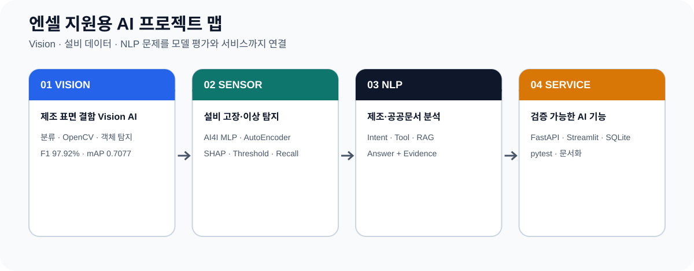

# 김수진 | AI 개발자

> **제조 데이터의 Vision·설비 센서·NLP 문제를 Python과 PyTorch로 구현하고,
> 모델 평가·실패 분석·FastAPI·Streamlit까지 연결하는 신입 AI 개발자입니다.**

<p>
  
  
  
  
  
  
  
</p>

<p align="center">
  
</p>

---

## 한눈에 보는 지원 직무 적합성

| 엔셀 공고 키워드 | 프로젝트에서 보여주는 근거 |
|---|---|
| 인공지능 알고리즘 개발·연구 | CNN·ResNet18·Faster R-CNN·MLP·AutoEncoder 구현 및 비교 |
| 인공지능 서비스 솔루션 개발 | PyTorch Model → FastAPI → Streamlit·SQLite 연결 |
| Vision | 제조 이미지 정상·불량 분류, OpenCV 보조 분석, 6종 표면 결함 객체 탐지 |
| Time Series 관련 역량 | RNN·LSTM 구조 학습, 설비 상태·센서 데이터 기반 예측·이상 탐지 경험 |
| NLP | 제조 질문 Intent·Router·Tool, 공공문서 검색·근거 추적, 논문 텍스트 분석 |
| 데이터 처리·분석 | pandas·NumPy·scikit-learn·OpenCV·데이터 분포·불균형·오류 사례 분석 |
| Python | 데이터 전처리, 모델 학습·평가·추론, API, 테스트의 주 언어 |
| PyTorch | 분류·객체 탐지·MLP 고장 예측·AutoEncoder 이상 탐지 |
| 결과 도출 | Accuracy·Precision·Recall·F1·mAP·IoU·Confusion Matrix·실패 유형 |

> **Time Series 표현 기준**
> AI4I 프로젝트는 6개 설비 상태 Feature를 입력받는 고장 위험 예측이며, 순차 Window 기반 시계열 예측 모델이라고 주장하지 않습니다. RNN·LSTM은 전공 학습 경험으로, 센서 모델은 고장 예측·이상 탐지 구현 경험으로 구분합니다.

---

## 개발 방향

저는 모델을 학습하는 데서 끝내지 않고 다음 흐름을 직접 연결합니다.

```text
문제와 필요성 정의
→ 데이터 구조·분포·품질 확인
→ Baseline 구현
→ 개선 모델과 동일 기준 비교
→ 지표·오분류·실패 사례 분석
→ FastAPI 추론/Agent API 연결
→ Streamlit·SQLite 사용자 흐름 연결
→ pytest·README·결과 자료로 검증
```

- **Vision**: 이미지 분류·객체 탐지·오분류·Grad-CAM·Detection Failure Analysis
- **설비 데이터**: 클래스 불균형·Threshold·SHAP·Reconstruction Error·Anomaly Recall
- **NLP / Agent**: Intent Classification·Router·Tool·Evidence·Trace·LangGraph·MCP
- **문서 검색**: Query Classification·Section Boost·Top-K·Evidence Trace
- **서비스**: FastAPI·Pydantic·Streamlit·SQLite·Docker·GitHub Actions
- **검증**: Unit·API·Integration·Regression Test, 실행 결과와 한계 문서화

---

## 대표 프로젝트

| 프로젝트 | 문제와 필요성 | 범위 | 기술 스택 | 내 역할 | 평가·검증 |
|---|---|---|---|---|---|
| **[제조 표면 결함 Vision AI](https://github.com/lightleaping/manufacturing-vision-defect-analysis-system)** | 이미지 전체의 불량 여부와 개별 결함의 종류·위치를 각각 확인할 필요 | 분류·OpenCV·객체 탐지·API·Dashboard | Python, PyTorch, torchvision, OpenCV, FastAPI, Streamlit | 1인 기획·데이터 분석·모델·평가·API·화면·테스트·문서화 | F1 **97.92%**, mAP@0.50 **0.707726**, **1,737 passed** |
| **[AI4I 기반 설비 고장 예측](https://github.com/lightleaping/manufacturing-ai-quality-agent-reference)** | 고장 확률만으로 판단 이유와 Agent 실행 과정을 확인하기 어려움 | MLP·Threshold·SHAP·LangGraph·Trace·SQLite·Dashboard | Python, PyTorch, LangGraph, OpenAI API, SHAP, FastAPI, SQLite | 1인 기획·설계·모델·Agent·API·평가·테스트 | Agent 평가 **6/6 PASS**, **307 passed** |
| **[제조 품질 분석 NLP Agent](https://github.com/lightleaping/manufacturing-mcp-agent)** | 제조 질문별로 필요한 데이터와 계산 기능이 다름 | Intent·Router·4 Tools·Evidence·AutoEncoder API | Python, FastAPI, LangGraph, pandas, PyTorch, Docker | 데이터·Intent·Tool·Workflow·API·CI 구현 | **4 Intents · 4 Tools · 2 Endpoints · 9 Tests** |
| **[다변량 센서 이상 탐지](https://github.com/lightleaping/sensor-anomaly-model-pipeline)** | 정상 센서 패턴에서 벗어난 입력을 이상 점수로 판별할 파이프라인 필요 | 전처리·AutoEncoder·Threshold·평가·CLI·API | Python, PyTorch, pandas, scikit-learn, FastAPI | 데이터 생성·전처리·학습·평가·추론·문서화 | Accuracy·Precision·Recall·F1·Matrix, 샘플 anomaly Recall **1.0** |
| **[공정거래 의결서 NLP 검색](https://github.com/lightleaping/fair-decision-rag)** | 긴 의결서의 관련 근거를 중복 없이 찾고 원문 위치를 추적할 필요 | Query Classification·Section Boost·Top-5 Evidence | Python, BM25, Dense Retrieval, FAISS 설계, RAG | 검색 규칙·Top-K·근거 ID 검증·문서화 | 정확히 **5개**, 중복 없는 기존 `chunk_id` 규칙 |
| **임상 의학 논문 NLP 동향 분석** | 많은 논문에서 반복 주제와 기술 동향을 파악할 필요 | 논문 수집·텍스트 정리·키워드 분석·팀 보고서 | Python 기반 텍스트 처리·시각화 경험 | 팀 프로젝트 자료 수집·분석·보고서 | Source 미보관, Documentation-only로 범위 명시 |

---

## 01. 제조 표면 결함 Vision AI

**저장소:** [`manufacturing-vision-defect-analysis-system`](https://github.com/lightleaping/manufacturing-vision-defect-analysis-system)

### 문제
정상·불량 분류는 이미지 전체 상태를 판단하지만 결함 Class와 위치를 제공하지 않습니다. 객체 탐지는 개별 결함의 종류와 위치를 찾지만 이미지 전체의 정상·불량 판정을 대신하지 않습니다.

### 수행
- Casting Product Image Data 7,348장 분석 및 Train·Validation·Test 구성
- CNN Baseline으로 학습·평가 파이프라인 검증
- ResNet18 전이학습과 동일 조건 성능 비교
- 오분류 19개를 False Positive 13개·False Negative 6개로 구분
- Grad-CAM을 판단 근거라고 단정하지 않고 모델 반응 영역 확인의 보조 수단으로 활용
- NEU Surface Defect 1,800장, 6 Class 객체 탐지
- Faster R-CNN MobileNetV3 Large 320 FPN 학습·평가
- 누락·저확신·위치 오류·중복·클래스 혼동 분석
- FastAPI 분류·검출 Endpoint와 Streamlit API Client 연결

### 결과
| Metric | Result |
|---|---:|
| Classification Accuracy | **97.34%** |
| Classification F1 | **97.92%** |
| Detection Precision | **0.812950** |
| Detection Recall | **0.526807** |
| Detection F1 | **0.639321** |
| Detection mAP@0.50 | **0.707726** |
| Mean Matched IoU | **0.752338** |
| Regression Tests | **1,737 passed** |

---

## 02. AI4I 기반 설비 고장 예측

**저장소:** [`manufacturing-ai-quality-agent-reference`](https://github.com/lightleaping/manufacturing-ai-quality-agent-reference)

### 문제
AI4I 고장 Class는 약 3.4%로 불균형해 Accuracy만으로 모델을 판단하기 어렵습니다. 또한 고장 확률 하나만 제공하면 어떤 입력 특성이 영향을 주었고 Agent가 어떤 경로로 처리했는지 확인하기 어렵습니다.

### 수행
- 6개 설비 상태 Feature 전처리와 StandardScaler 적용
- PyTorch MLP, `pos_weight`, Threshold 0.50~0.90 비교
- Recall 조건과 F1을 고려한 Threshold 0.70 저장
- Prediction·Rule·SHAP Local·Permutation Importance Evidence 구성
- OpenAI Intent JSON 검증과 Rule Fallback
- LangGraph Routing, Trace Event, SQLite 실행 이력
- FastAPI Prediction·Agent·History API와 Streamlit 4개 페이지
- MCP stdio Tool 연결

### 검증
- Day 4 대표 실험: Accuracy 0.9305, Precision 0.3060, Recall 0.8235, F1 0.4462
- Deterministic Agent Evaluation: **6/6 PASS**
- 실제 OpenAI E2E 시나리오: **PASS**
- 전체 회귀 테스트: **307 passed**

> 재학습 시 PyTorch 학습 Seed가 완전히 고정되지 않은 버전에서는 확률 분포와 Threshold가 달라질 수 있어, 저장 Artifact의 결과와 재학습 결과를 구분합니다.

---

## 03. 제조 품질 분석 NLP Agent

**저장소:** [`manufacturing-mcp-agent`](https://github.com/lightleaping/manufacturing-mcp-agent)

```text
사용자 질문 → Intent → Router → 제조 Tool → Summary + Evidence
```

- `defect_rate`: 라인별 불량률 분석
- `sensor_anomaly`: 최근 센서 이상 구간 탐지
- `line_performance`: 생산성·품질 상태 요약
- `quality_issue_candidates`: 불량률·센서 지표 기반 우선 점검 후보
- `/agent/query`: Agent Workflow
- `/model/sensor-anomaly`: PyTorch AutoEncoder 독립 Endpoint
- Docker·GitHub Actions·pytest 기반 재현과 검증

규칙 기반 `risk_score`는 머신러닝 원인 확률이 아니라 우선 점검 후보를 좁히는 휴리스틱이라는 점을 명시했습니다.

---

## 04. 다변량 센서 이상 탐지

**저장소:** [`sensor-anomaly-model-pipeline`](https://github.com/lightleaping/sensor-anomaly-model-pipeline)

```text
센서 데이터 생성 → 결측치 처리 → Split → StandardScaler
→ 정상 데이터 AutoEncoder 학습 → Reconstruction Error
→ Validation 95 Percentile Threshold → 평가 → CLI / FastAPI
```

- 입력: 온도·진동·압력·습도
- 정상 데이터만 사용해 정상 패턴 학습
- Validation Reconstruction Error 95 Percentile로 Threshold 설정
- Accuracy·Precision·Recall·F1·Confusion Matrix 평가
- 샘플 테스트에서 anomaly Recall 1.0 확인
- 일부 정상 샘플을 이상으로 판단한 Trade-off 함께 설명
- `/predict` 응답에 Prediction·Reconstruction Error·Threshold 포함

---

## 05. 공정거래 의결서 NLP 검색

**저장소:** [`fair-decision-rag`](https://github.com/lightleaping/fair-decision-rag)

### 목표 구조
```text
공개 의결서 → Section-aware Chunk → BM25 + Dense Retrieval
→ Query Classification → Section Boost → Duplicate Removal
→ Top-5 chunk_id → Evidence Trace
```

### 현재 공개 검증 범위
- 질문 분류·Section Boost·Top-5 선택 규칙
- 정확히 5개의 결과
- 중복 없는 기존 `chunk_id`
- 외부 API 미사용
- 별도 모델 학습 미수행

현재 공개 저장소는 README 중심이므로 전체 Hybrid Retrieval Source가 공개되지 않은 부분은 구현 완료로 과장하지 않습니다.

---

## 06. 임상 의학 논문 NLP 동향 분석

전공 팀 프로젝트로 임상 의학 기술 발전 관련 논문 자료를 수집하고, 텍스트를 정리해 주요 키워드와 기술 동향을 분석했습니다.

> 당시 Source·Dataset·정량 평가 자료가 현재 보관되어 있지 않습니다.
> 실행 가능한 NLP 시스템으로 표현하지 않고 **Documentation-only Case Study**로 공개합니다.

주장하지 않는 내용:
- BERT·Transformer Fine-tuning
- 대규모 자연어 Dataset 처리
- 특정 Accuracy·Precision·Recall·F1
- 운영 가능한 NLP API

---

## 기술 스택

| 분야 | 기술 |
|---|---|
| Language | Python, SQL |
| Deep Learning | PyTorch, torchvision, CNN, ResNet18, Faster R-CNN, MLP, AutoEncoder |
| Vision | OpenCV, Image Classification, Object Detection, Grad-CAM |
| Sensor / Data | pandas, NumPy, scikit-learn, StandardScaler, Reconstruction Error, Threshold Evaluation |
| NLP / Agent | Intent Classification, Router, Tool, Evidence, LangGraph, MCP, OpenAI API |
| Document Retrieval | BM25, Dense Retrieval, FAISS 설계, Section Boost, Top-K, Evidence Trace |
| Backend | FastAPI, Pydantic, REST API, Uvicorn, httpx |
| Service / Storage | Streamlit, SQLite |
| Verification | pytest, Unit Test, API Test, Integration Test, Regression Test |
| Development | Git, GitHub, Docker, GitHub Actions |

---

## 작업 원칙

- AI 도구로 초안을 구성하더라도 코드의 입력·출력·호출 관계를 직접 확인합니다.
- 모델 지표는 저장 Artifact와 실행 로그를 기준으로 표기합니다.
- Grad-CAM을 모델의 확정적인 판단 근거라고 표현하지 않습니다.
- AI4I 상태 Feature 프로젝트를 Sequence Forecasting으로 과장하지 않습니다.
- Source가 없는 프로젝트는 Documentation-only로 표시합니다.
- 자동 검증과 수동 Browser 확인 기록을 동일하게 취급하지 않습니다.
- 모델 성능뿐 아니라 실패 사례·한계·개선 방향을 함께 설명합니다.

---

## 연락처

- GitHub: [github.com/lightleaping](https://github.com/lightleaping)
- Email: workingskyroad@gmail.com

<!-- PDF 포트폴리오 공개 후 아래 링크를 활성화하세요.
- Portfolio: [AI 개발자 포트폴리오](./portfolio/soojin-kim-ai-developer-portfolio.pdf)
-->
