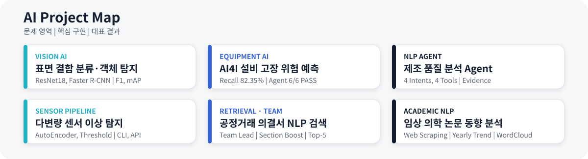

<div align="center">


<br>


</div>

---

## Core Strengths

| **Vision AI** | **Equipment & Sensor Data** | **NLP & Agent** | **AI Service Solution** |
|---|---|---|---|
| 이미지 분류, 객체 탐지, OpenCV, Grad-CAM, 실패 사례 분석 | 설비 상태 분류, 클래스 불균형 대응, SHAP, AutoEncoder 이상 탐지 파이프라인 | Intent, Router, Tool, Evidence, Retrieval, 연도별 동향 분석 | PyTorch Model, FastAPI, Streamlit, SQLite, Docker, API와 통합 테스트 |

> **데이터 전처리 → 모델 구현과 평가 → FastAPI와 Streamlit 연결**까지 직접 수행한 프로젝트 경험을 보유하고 있습니다.

---

## Project Map



---

## Representative Projects

| Project | Problem | Tech Stack | Project Scope | Evidence |
|---|---|---|---|---|
| **[제조 표면 결함 Vision AI](https://github.com/lightleaping/manufacturing-vision-defect-analysis-system)**<br><sub>Manufacturing Vision Defect Analysis System</sub> | 정상과 불량을 판정하고 결함 종류와 위치를 함께 확인 | Python, PyTorch, ResNet18, Faster R-CNN, OpenCV, FastAPI, Streamlit | 기간: **2026.07**<br>형태: **개인 프로젝트**<br>범위: 이미지 분석, 분류 모델, 객체 탐지 모델, 성능 평가, 실패 사례 분석, API, Dashboard, 테스트, 문서화 | **DEFECT-class F1 97.92%**<br>**mAP@0.50 0.7077** |
| **[AI4I 기반 설비 고장 예측](https://github.com/lightleaping/manufacturing-ai-quality-agent)**<br><sub>Manufacturing AI Quality Agent</sub> | 불균형한 설비 고장 데이터를 예측하고 판단 근거와 실행 이력을 함께 제공 | Python, PyTorch MLP, SHAP, LangGraph, FastAPI, SQLite, Streamlit | 기간: **2026.05–07**<br>형태: **개인 프로젝트**<br>범위: 데이터 처리, 고장 예측 모델, 설명 정보, Agent, Trace, API, Dashboard, 평가, 테스트 | **Recall 82.35%**<br>Agent 평가 **6/6 PASS** |
| **[제조 품질 분석 NLP Agent](https://github.com/lightleaping/manufacturing-mcp-agent)**<br><sub>Manufacturing MCP Agent</sub> | 제조 질문에 맞는 분석 Tool을 선택하고 결과 근거를 반환 | Python, FastAPI, Intent, Router, Tool, Evidence, Docker | 기간: **2026.04–05**<br>형태: **개인 프로젝트**<br>범위: 제조 데이터, Intent 분류, Router, 4개 Tool, Evidence 응답, 모델 Endpoint, API, CI | **4 Intents, 4 Tools**<br>**2 Core POST Endpoints** |
| **[다변량 센서 이상 탐지](https://github.com/lightleaping/sensor-anomaly-model-pipeline)**<br><sub>Sensor Anomaly Model Pipeline</sub> | Scale이 다른 센서값을 하나의 이상 탐지 흐름으로 연결 | Python, PyTorch, AutoEncoder, StandardScaler, FastAPI | 기간: **2026.05**<br>형태: **개인 프로젝트**<br>범위: 데이터 생성, 결측치 처리, Split, Scaler, AutoEncoder 구조, 학습 코드와 평가 코드, Threshold, CLI, API | 합성 Held-out Test<br>**Recall 96.67% · F1 86.57%** |
| **[공정거래 의결서 NLP 검색](https://github.com/lightleaping/fair-decision-rag)**<br><sub>Fair Decision RAG</sub> | 긴 의결서에서 질문 관련 근거 Top-5와 근거 기반 답변을 제공 | Python, BM25, Dense Retrieval, Section Boost, FastAPI, Docker | 기간: **2026.05–07**<br>형태: **공모전 팀 프로젝트**<br>본인 기여: **Team Lead**, 질문 분류, Dense Baseline, Section Boost, 검색 평가, 일정·범위·통합 관리 | Silver QA **Recall@5 0.9850**<br>Offline Docker **200/200 PASS** |
| **[임상 의학 논문 NLP 동향 분석](https://github.com/lightleaping/clinical-medical-paper-nlp-trend-analysis)**<br><sub>Clinical Medical Paper NLP Trend Analysis</sub> | 임상 의학 논문 데이터를 활용해 연도별 동향을 분석 | Python, Web Scraping, WordCloud | 기간: **2025.03–06**<br>형태: **전공 팀 프로젝트**<br>본인 기여: 개인 Scraping 코드, 주제 선정 논의, 보고서 결론 파트 | 연도별 분석과 WordCloud를 포함한 팀 보고서 제출 |
---

## Project Details

<details open>
<summary><b>01 | 제조 표면 결함 Vision AI</b> <sub>(Manufacturing Vision Defect Analysis System)</sub><b> — F1 97.92%, mAP@0.50 0.7077</b></summary>

<br>

### Problem

이미지 전체의 정상 여부와 불량 여부뿐 아니라, 개별 결함의 종류와 위치까지 확인할 수 있는 제조 Vision 흐름이 필요했습니다.

### Implementation

```text
이미지 데이터 분석
→ CNN Baseline / ResNet18 분류
→ 오분류 분석 및 Grad-CAM 확인
→ Faster R-CNN 객체 탐지
→ FastAPI 분류 API와 검출 API
→ Streamlit 결과 확인
```

- Casting Product Image Data 7,348장 분석
- CNN Baseline과 ResNet18 전이학습 비교
- False Positive와 False Negative 오분류 분석
- NEU Surface Defect 1,800장, 6개 Class 객체 탐지
- 분류와 검출 결과를 독립된 API Endpoint로 제공

### Evidence

- ResNet18 Test Accuracy **97.34%**
- DEFECT-class F1 **97.92%**
- Detection mAP@0.50 **0.707726**
- Mean Matched IoU **0.752338**

### Project Scope

| 항목 | 내용 |
|---|---|
| **일정** | 2026.07 |
| **형태** | 개인 프로젝트 |
| **프로젝트 범위** | 이미지 데이터 분석, CNN Baseline과 ResNet18 분류, Faster R-CNN 객체 탐지, 오분류 분석, Grad-CAM, FastAPI 분류 API와 검출 API, Streamlit Dashboard, 테스트, 문서화 |

</details>

<details>
<summary><b>02 | AI4I 기반 설비 고장 예측</b> <sub>(Manufacturing AI Quality Agent)</sub><b> — Recall 82.35%, Agent 6/6 PASS</b></summary>

<br>

### Problem

고장 Class가 적은 설비 데이터에서 고장 위험을 탐지하고, 예측 결과와 함께 주요 입력 특성, 처리 경로, 실행 이력을 확인할 필요가 있었습니다.

### Implementation

```text
AI4I 설비 Feature
→ PyTorch MLP 고장 예측
→ Rule / SHAP Evidence
→ LangGraph Agent
→ Trace / SQLite History
→ FastAPI / Streamlit
```

- StandardScaler와 `pos_weight`를 적용한 PyTorch MLP
- Threshold 비교를 통한 고장 위험 단계 구성
- SHAP Local과 Permutation Importance 기반 Evidence
- LangGraph Routing과 Trace Event
- SQLite 실행 이력과 Streamlit 4개 페이지

### Evidence

- Recall **82.35%**
- Agent Evaluation **6/6 PASS**
- 실제 OpenAI E2E 시나리오 PASS
- 전체 회귀 테스트 307 passed

### Project Scope

| 항목 | 내용 |
|---|---|
| **일정** | 2026.05–07 |
| **형태** | 개인 프로젝트 |
| **프로젝트 범위** | AI4I 데이터 처리, PyTorch MLP 고장 예측, 클래스 불균형 대응, SHAP과 Permutation Importance, LangGraph Agent, Trace와 SQLite 이력, FastAPI, Streamlit Dashboard, 평가, 테스트 |

</details>

<details>
<summary><b>03 | 제조 품질 분석 NLP Agent</b> <sub>(Manufacturing MCP Agent)</sub><b> — 4 Intents, 4 Tools, 2 Core POST Endpoints</b></summary>

<br>

### Problem

불량률, 센서 이상, 라인 성능, 원인 후보처럼 제조 질문마다 필요한 데이터와 분석 기능이 달랐습니다.

### Implementation

```text
사용자 질문
→ Intent
→ Router
→ 제조 Tool
→ Answer + Evidence
```

- `defect_rate`
- `sensor_anomaly`
- `line_performance`
- `quality_issue_candidates`
- `/agent/query`
- `/model/sensor-anomaly`
- Docker, GitHub Actions, pytest

### Evidence

- **4 Intents**
- **4 Tools**
- **2 Core POST Endpoints**
- 9 핵심 테스트

### Project Scope

| 항목 | 내용 |
|---|---|
| **일정** | 2026.04–05 |
| **형태** | 개인 프로젝트 |
| **프로젝트 범위** | 제조 데이터 처리, Intent 분류, Router, 4개 제조 Tool, Answer와 Evidence 응답, Sensor Anomaly 모델 Endpoint, FastAPI, Docker, GitHub Actions, pytest |

</details>

<details>
<summary><b>04 | 다변량 센서 이상 탐지</b> <sub>(Sensor Anomaly Model Pipeline)</sub><b> — Recall 96.67%, F1 86.57%</b></summary>

<br>

### Problem

온도, 진동, 압력, 습도처럼 Scale이 다른 센서값을 동일한 전처리, 학습, 평가, 추론 구조로 연결할 필요가 있었습니다.

### Implementation

```text
센서 데이터
→ 결측치 처리 / Split / StandardScaler
→ 4→8→2→8→4 AutoEncoder
→ Reconstruction Error
→ Validation Threshold
→ CLI / FastAPI
```

- 데이터 생성과 전처리 모듈
- PyTorch AutoEncoder 구조
- MSE Loss와 Adam 기반 학습/검증 Loop 코드
- Reconstruction Error와 Percentile Threshold
- CLI와 FastAPI `/predict` 응답 구조

### Evidence

- 합성 Held-out Test Accuracy **95.00%**
- Anomaly Recall **96.67%**
- F1 Score **86.57%**
- Confusion Matrix **TN 284, FP 16, FN 2, TP 58**
- Validation 데이터로 Threshold를 정하고, 분리된 Test 데이터로 최종 성능 평가

### Project Scope

| 항목 | 내용 |
|---|---|
| **일정** | 2026.05 |
| **형태** | 개인 프로젝트 |
| **프로젝트 범위** | 합성 센서 데이터 생성, Train·Validation·Test 분리, Train 기준 StandardScaler, 정상 데이터 기반 AutoEncoder 학습, Early Stopping, Validation Threshold, Held-out Test 평가, Checkpoint, Model Card, CLI, FastAPI, pytest, GitHub Actions |

</details>

<details>
<summary><b>05 | 공정거래 의결서 NLP 검색</b> <sub>(Fair Decision RAG)</sub><b> — Team Lead, Silver Recall@5 0.9850</b></summary>

<br>

### Problem

긴 공정거래 의결서에서 질문과 관련된 근거를 찾고, 중복 없이 원문 위치를 추적할 필요가 있었습니다.

### Implementation


```text
공개 의결서 31,877개 청크
→ BM25 / Dense Retrieval
→ Query Classification
→ Weighted Score Fusion / Section Boost
→ Unique and Valid Top-5
→ Grounded Extractive Answer
→ FastAPI / Offline Docker
```

- 공정거래위원회 공개 의결서 청크 31,877개 처리
- BM25와 다국어 MiniLM Dense Retrieval 결과를 가중 결합
- Query Classification과 Section Boost로 질문 유형별 순위 보정
- 원본 `chunk_id` 유효성 검사와 중복 없는 Top-5 반환
- 검색된 Top-5 범위 안에서 추출형 Answer와 Evidence Trace 구성
- FastAPI와 외부 네트워크 없는 Docker 실행 환경 구현

### Evidence

- 자체 생성 Silver QA 500개 기준 Recall@5 **0.9850**
- Silver QA 기준 MRR **0.9810**
- Offline Docker HTTP 요청 **200/200 PASS**
- 평균 응답시간 **1.4503초**, 최대 **13.3913초**
- Generation Token F1은 **0.0595**로 답변 선택과 압축에 개선 필요
- 공식 비공개 Gold Set 평가 결과가 아닌 개발·회귀 검증용 수치

### Project Scope

| 항목 | 내용 |
|---|---|
| **일정** | 2026.05–07 |
| **형태** | 공모전 팀 프로젝트 |
| **프로젝트 범위** | 공개 의결서 31,877개 청크 처리, BM25와 Dense Retrieval, Query Classification, Score Fusion, Section Boost, 원본 ID 검증, Top-5 Evidence, 추출형 Answer, FastAPI, Offline Docker, Silver QA 평가와 HTTP 안정성 검증 |
| **본인 기여** | **Team Lead**로서 질문 분류, Dense Baseline, Section Boost, Top-K 검증, 검색 결과 평가, Sprint 운영, 일정과 MVP 범위 조정, 지연 작업 지원, GitHub 통합 상태 확인 |

</details>

<details>
<summary><b>06 | 임상 의학 논문 NLP 동향 분석</b> <sub>(Clinical Medical Paper NLP Trend Analysis)</sub><b> — Web Scraping, Yearly Trend, WordCloud</b></summary>

<br>

### Problem

임상 의학 관련 논문 데이터를 활용해 연도에 따른 연구 동향을 살펴보는 전공 팀 프로젝트를 수행했습니다.

### Implementation

```text
팀원별 Web Scraping 코드 구현
→ 분석 주제 논의
→ 임상 의학 선정
→ 연도별 동향 분석
→ WordCloud 시각화
→ 팀 보고서 작성 및 제출
```

### Evidence

- 임상 의학 관련 논문 데이터의 연도별 동향 분석
- WordCloud 기반 결과 시각화
- 분석 결과를 정리한 팀 보고서 제출

### Project Scope

| 항목 | 내용 |
|---|---|
| **일정** | 2025.03–06 |
| **형태** | 동양미래대학교 전공 팀 프로젝트 |
| **프로젝트 범위** | 팀원별 Web Scraping 코드 작성, 분석 주제 선정, 임상 의학 논문의 연도별 동향 분석, WordCloud 시각화, 팀 보고서 작성 |
| **본인 기여** | 개인 Web Scraping 코드 구현, 주제 선정 논의 참여, 보고서 결론 파트 작성 |

</details>

---

## Core Stack

| 영역 | 기술 |
|---|---|
| **Language & Data** | Python, SQL, pandas, NumPy, scikit-learn |
| **Deep Learning & Vision** | PyTorch, torchvision, CNN, ResNet18, Faster R-CNN, MLP, AutoEncoder, OpenCV, Grad-CAM |
| **NLP & Agent** | Web Scraping, Keyword Analysis, Intent, Router, Tool, Evidence, LangGraph, MCP |
| **Retrieval** | BM25, Dense Retrieval, FAISS, Section Boost, Top-K Evidence |
| **Backend & Service** | FastAPI, Pydantic, Streamlit, SQLite, REST API |
| **Verification & Development** | pytest, Git, GitHub, Docker, GitHub Actions |

---

## Contact

- **GitHub:** [github.com/lightleaping](https://github.com/lightleaping)
- **Email:** workingskyroad@gmail.com

<!-- 공개용 포트폴리오 PDF 업로드 후 활성화
- **Portfolio:** [AI Developer Portfolio](./docs/portfolio/soojin-kim-ai-developer-portfolio-public.pdf)
-->
