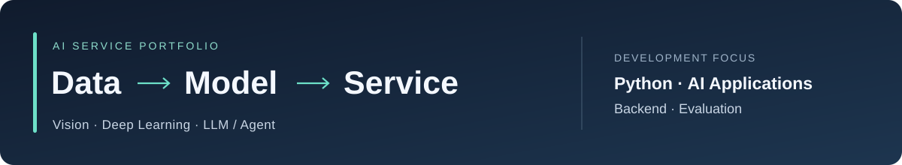

# 김수진 | AI 개발자

**AI 기능을 실제 서비스로 연결하는 AI 서비스 개발자를 지향합니다.**

학교와 프로젝트를 통해 AI·SW 기능을 단위별로 구현하고 실습해 왔으며,
현재는 데이터·모델/LLM·API·DB·도구를 하나의 서비스 흐름으로 연결하고
검증하는 역량을 집중적으로 강화하고 있습니다.

## Current Focus

- Generative AI / LLM
- AI Agent / Tool Use
- Backend / API
- Manufacturing AI

---

## Featured Projects

### 01. Manufacturing MCP Agent
**Status: Implemented**

제조 현장의 자연어 질문을 목적에 맞는 데이터 분석 기능으로 연결하고,
분석 결과와 근거 데이터를 함께 반환하는 Agent API입니다.

`Question → Intent → Router → Manufacturing Tool → Answer + Evidence`

- 규칙 기반 4개 Intent 분류
- 4개 제조 데이터 분석 Tool
- 동일 분석 기능을 4개 MCP Tool로 제공
- FastAPI 기반 Agent API
- Agent Flow · Tool · Model 핵심 테스트 9개

**Tech:** Python · FastAPI · pandas · Pydantic · LangGraph · FastMCP · pytest

> 현재 Intent와 Answer 생성에는 외부 LLM을 사용하지 않습니다.

[Repository](https://github.com/lightleaping/manufacturing-mcp-agent)

---

### 02. Structured Bloom
**Status: Re-validation in Progress**

AI웹융합 과제에서 구현한 React + FastAPI + OpenAI API 기반 웹 서비스입니다.

`React → FastAPI → OpenAI → Structured JSON → Pydantic Validation → UI`

사용자의 상태와 사용 가능한 시간을 입력받고,
LLM 응답을 구조화된 JSON으로 받아 Pydantic으로 검증한 뒤
React 화면에 결과를 표시하도록 구성했습니다.

현재 과거 구현 코드를 다시 실행하면서
API 요청·응답 흐름, Validation, 오류 처리와 직접 구현 범위를 재검증하고 있습니다.

**Tech:** React · JavaScript · FastAPI · OpenAI API · Pydantic

[Repository](https://github.com/lightleaping/s23.aiweb2026.site)

---

### 03. 사례 기반 웹서비스 이상탐지·분석 Agent
**Status: Work in Progress · Team Lead / Agent·Backend**

웹서비스 요청 로그에서 이상 사건을 탐지하고,
관련 사례와 Runbook을 검색하여 근거 기반 원인 후보와
사건 분석 결과를 제공하는 AI종합설계 졸업작품입니다.

`Request Logs → Anomaly Detection → Case / Runbook Retrieval → Evidence-based Cause Analysis → Incident Report`

팀장으로 프로젝트 범위와 모듈 간 데이터 전달 규격을 조율하고 있으며,
Agent·Backend 영역을 담당하고 있습니다.

현재 팀별 모듈을 구현·검증하는 단계이며,
전체 End-to-End 연결은 아직 검증되지 않았습니다.

현재 공개 저장소에는 본인이 담당한 범위와
공개 가능한 설계·진행 상태부터 순차적으로 반영하고 있습니다.

[Repository](https://github.com/lightleaping/case-based-anomaly-agent)

---

## Additional Project

### World Character Engine
**Status: Partial Implementation — State / Action Core**

캐릭터의 현재 상태와 행동 조건을 코드로 관리하고,
검증된 행동만 세계 상태에 반영하는 Python 기반 상태·행동 엔진입니다.

**현재 구현 범위**
- 상태 생성 및 관리
- 행동 허용 여부와 선행 조건 검증
- 성공한 행동의 상태 반영
- 실패 시 상태 유지
- 중복 행동 처리
- 성공·실패·누락·중복 경로 자동 테스트 13개

**아직 구현하지 않은 범위**
- LLM 연동
- 장기 기억 / RAG
- XR 연동

**Tech:** Python

[Repository](https://github.com/lightleaping/world-character-engine)

---

## Technical Experience

기술 경험은 현재 프로젝트에서 확인한 범위와
학교·교육에서 실습한 경험을 구분해 정리합니다.

### Project Experience

현재 프로젝트의 코드와 동작을 기준으로 설명할 수 있는 기술입니다.

- Python
- FastAPI
- pandas
- Pydantic
- LangGraph
- FastMCP
- pytest

### Practice Experience / Review

학교·교육에서 기능 단위로 실습한 경험이 있으며,
현재 다시 실행하고 원리를 설명할 수 있도록 복습하고 있습니다.

- SQL / DB
- Machine Learning
- PyTorch
- Vision / OpenCV / YOLO
- NLP
- Generative AI / Function Calling

---

## Current Learning

현재 학교 수업과 2026 스마트제조 전문인력 육성사업 교육을 통해
기존 실습 경험을 다시 확인하고 서비스 개발 흐름으로 연결하고 있습니다.

`Data → AI / LLM → API / DB → Tool → Evidence → Test`

학습 코드를 그대로 포트폴리오에 사용하는 대신,
직접 다시 실행하고 수정·검증한 범위부터 GitHub에 정리할 예정입니다.

---

## Development Approach

- 구현된 기능과 계획 단계 기능을 구분합니다.
- 실행 결과와 성능은 검증 조건과 함께 기록합니다.
- 과거 실습은 다시 실행하고 설명 가능한 범위부터 현재 역량으로 반영합니다.
- AI 기능뿐 아니라 입력부터 API·도구·근거·검증까지 이어지는 흐름을 확인합니다.

---

## Relevant Coursework

Programming / SW · Web / Backend / DB · Data / ML · Deep Learning / Vision · NLP / AI Service

---

## Contact

[GitHub · lightleaping](https://github.com/lightleaping) · [workingskyroad@gmail.com](mailto:workingskyroad@gmail.com)

Updated 2026-10-01 · 구현·실습·진행 중인 범위를 구분해 공개합니다.
